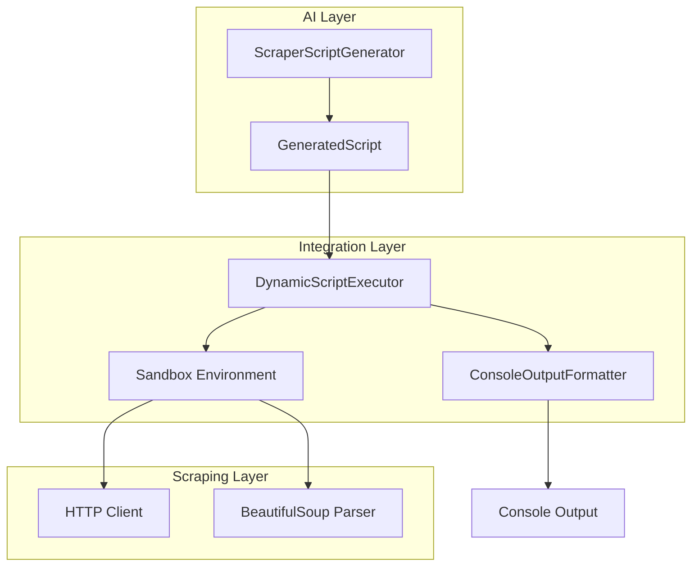
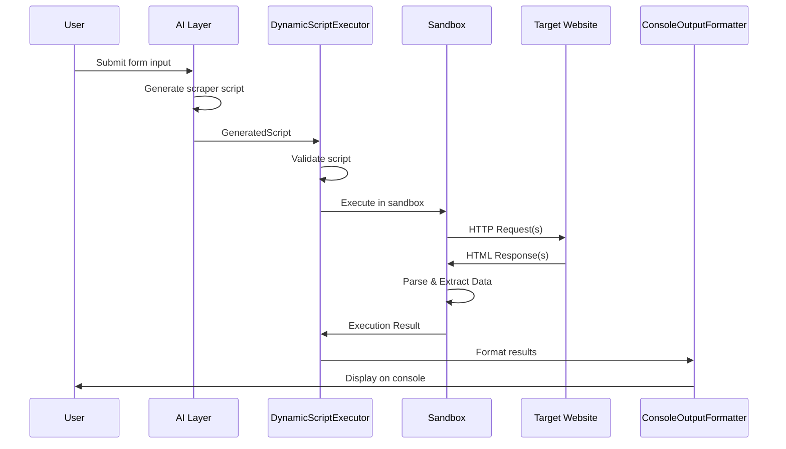
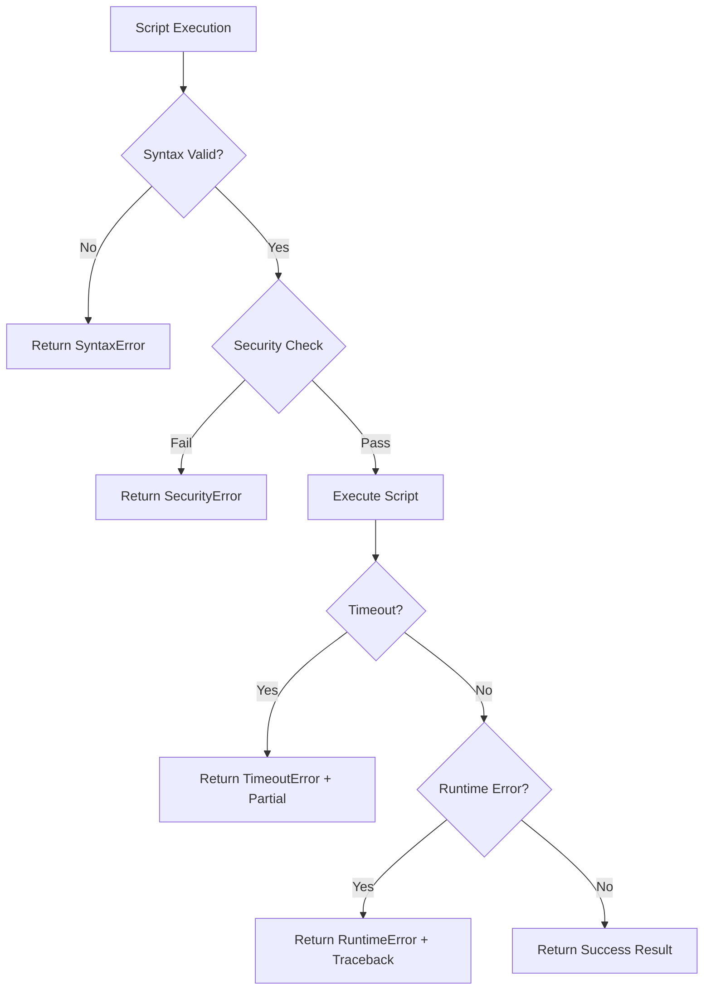

# Design Document: AI-Scraping Layer Integration

## Overview

This design describes the integration between the AI layer (which generates scraper scripts) and the scraping layer (which executes them). The core component is a Dynamic Script Executor that safely executes AI-generated Python code strings and returns structured results. The system supports multiple data sources per script and provides formatted console output.

The design follows a pipeline architecture:

1. **Input**: GeneratedScript from AI layer
2. **Execution**: Dynamic Script Executor runs the code safely
3. **Output**: Formatted results displayed on console

## Architecture



### Component Interaction Flow



## Components and Interfaces

### 1. DynamicScriptExecutor

The main orchestrator that executes AI-generated scripts safely.

```python
from dataclasses import dataclass
from typing import Dict, Any, List, Optional
from datetime import datetime

@dataclass
class ExecutionConfig:
    """Configuration for script execution."""
    timeout_seconds: int = 60
    max_memory_mb: int = 256
    allowed_imports: List[str] = None  # Default: requests, bs4, re, json, datetime

    def __post_init__(self):
        if self.allowed_imports is None:
            self.allowed_imports = [
                'requests', 'bs4', 'BeautifulSoup', 're', 'json',
                'datetime', 'typing', 'urllib'
            ]


@dataclass
class ExecutionResult:
    """Result of script execution."""
    success: bool
    data: List[Dict[str, Any]]
    metadata: Dict[str, Any]
    errors: List[str]
    execution_time_ms: int
    source_results: List['SourceResult']  # Per-source breakdown


@dataclass
class SourceResult:
    """Result from a single data source."""
    source_url: str
    success: bool
    record_count: int
    error: Optional[str]
    execution_time_ms: int


class DynamicScriptExecutor:
    """Executes AI-generated Python scraper scripts dynamically."""

    def __init__(self, config: ExecutionConfig = None):
        self.config = config or ExecutionConfig()
        self.logger = logging.getLogger(__name__)

    def execute(self, generated_script: GeneratedScript) -> ExecutionResult:
        """
        Execute a generated script and return results.

        Args:
            generated_script: GeneratedScript from AI layer

        Returns:
            ExecutionResult with data and metadata
        """
        pass

    def execute_code(self, script_code: str, target_url: str = None) -> ExecutionResult:
        """
        Execute raw Python code string.

        Args:
            script_code: Python code as string
            target_url: Optional URL to pass to scrape_data function

        Returns:
            ExecutionResult with data and metadata
        """
        pass
```

### 2. ScriptSandbox

Provides isolated execution environment for scripts.

```python
class ScriptSandbox:
    """Sandboxed execution environment for scraper scripts."""

    FORBIDDEN_BUILTINS = {
        'eval', 'exec', 'compile', '__import__',
        'open', 'input', 'breakpoint'
    }

    FORBIDDEN_MODULES = {
        'os', 'sys', 'subprocess', 'shutil',
        'socket', 'pickle', 'marshal'
    }

    def __init__(self, config: ExecutionConfig):
        self.config = config
        self.logger = logging.getLogger(__name__)

    def execute(self, script_code: str, entry_function: str, args: tuple) -> Any:
        """
        Execute script code in sandboxed environment.

        Args:
            script_code: Python code to execute
            entry_function: Name of function to call (e.g., 'scrape_data')
            args: Arguments to pass to the function

        Returns:
            Return value from the entry function

        Raises:
            SecurityError: If script attempts forbidden operations
            TimeoutError: If execution exceeds timeout
            ScriptExecutionError: If script fails during execution
        """
        pass

    def _create_safe_globals(self) -> Dict[str, Any]:
        """Create restricted globals dict for script execution."""
        pass

    def _validate_imports(self, script_code: str) -> List[str]:
        """Check script imports against allowed list."""
        pass
```

### 3. ConsoleOutputFormatter

Formats and displays execution results on the console.

```python
class ConsoleOutputFormatter:
    """Formats scraping results for console display."""

    def __init__(self, max_records_display: int = 10, show_full_data: bool = False):
        self.max_records_display = max_records_display
        self.show_full_data = show_full_data

    def format_result(self, result: ExecutionResult) -> str:
        """
        Format execution result for console display.

        Args:
            result: ExecutionResult from script execution

        Returns:
            Formatted string for console output
        """
        pass

    def print_result(self, result: ExecutionResult) -> None:
        """Print formatted result to console."""
        pass

    def _format_header(self, result: ExecutionResult) -> str:
        """Format summary header."""
        pass

    def _format_data_records(self, data: List[Dict], source_url: str) -> str:
        """Format data records grouped by source."""
        pass

    def _format_metadata(self, metadata: Dict[str, Any]) -> str:
        """Format execution metadata."""
        pass

    def _format_errors(self, errors: List[str]) -> str:
        """Format error messages."""
        pass
```

### 4. AIScrapingIntegration

High-level integration class that ties everything together.

```python
class AIScrapingIntegration:
    """
    Main integration class connecting AI layer with scraping layer.

    Usage:
        integration = AIScrapingIntegration()
        result = integration.generate_and_execute(form_input)
        integration.display_results(result)
    """

    def __init__(
        self,
        script_generator: ScraperScriptGenerator = None,
        executor: DynamicScriptExecutor = None,
        formatter: ConsoleOutputFormatter = None
    ):
        self.script_generator = script_generator
        self.executor = executor or DynamicScriptExecutor()
        self.formatter = formatter or ConsoleOutputFormatter()

    def generate_and_execute(self, form_input: Dict[str, Any]) -> ExecutionResult:
        """
        Generate a scraper script and execute it.

        Args:
            form_input: User form input for script generation

        Returns:
            ExecutionResult with scraped data
        """
        pass

    def execute_script(self, generated_script: GeneratedScript) -> ExecutionResult:
        """
        Execute an already-generated script.

        Args:
            generated_script: Script from AI layer

        Returns:
            ExecutionResult with scraped data
        """
        pass

    def display_results(self, result: ExecutionResult) -> None:
        """Display results on console."""
        pass
```

## Data Models

### ExecutionResult

The primary output model containing all execution data.

```python
@dataclass
class ExecutionResult:
    """Complete result of script execution."""

    # Execution status
    success: bool

    # Extracted data
    data: List[Dict[str, Any]]

    # Execution metadata
    metadata: ExecutionMetadata

    # Errors encountered
    errors: List[str]

    # Per-source breakdown (for multi-source scripts)
    source_results: List[SourceResult]

    # Timing
    execution_time_ms: int
    scraped_at: datetime


@dataclass
class ExecutionMetadata:
    """Metadata about the execution."""

    # Counts
    total_count: int
    filtered_count: int
    duplicate_count: int

    # Script info
    script_id: Optional[str]
    target_urls: List[str]

    # AI generation info (if available)
    generation_time_ms: Optional[int]
    model_used: Optional[str]

    # Scraping method detected
    scraping_method: str  # 'table', 'cards', 'articles', 'generic'
    confidence: str  # 'high', 'medium', 'low'


@dataclass
class SourceResult:
    """Result from scraping a single data source."""

    source_url: str
    success: bool
    record_count: int
    filtered_count: int
    duplicate_count: int
    error: Optional[str]
    execution_time_ms: int
    scraping_method: str
    confidence: str
```

### Error Models

```python
class ScriptExecutionError(Exception):
    """Base exception for script execution errors."""

    def __init__(self, message: str, error_type: str, details: Dict[str, Any] = None):
        super().__init__(message)
        self.error_type = error_type
        self.details = details or {}


class SecurityError(ScriptExecutionError):
    """Raised when script attempts forbidden operations."""

    def __init__(self, message: str, forbidden_operation: str):
        super().__init__(message, 'security', {'forbidden_operation': forbidden_operation})


class ScriptTimeoutError(ScriptExecutionError):
    """Raised when script execution exceeds timeout."""

    def __init__(self, timeout_seconds: int, partial_results: List[Dict] = None):
        super().__init__(
            f"Script execution timed out after {timeout_seconds} seconds",
            'timeout',
            {'timeout_seconds': timeout_seconds, 'partial_results': partial_results}
        )
        self.partial_results = partial_results


class ScriptSyntaxError(ScriptExecutionError):
    """Raised when script has syntax errors."""

    def __init__(self, message: str, line_number: int, offset: int):
        super().__init__(
            message, 'syntax',
            {'line_number': line_number, 'offset': offset}
        )
```

## Correctness Properties

_A property is a characteristic or behavior that should hold true across all valid executions of a system—essentially, a formal statement about what the system should do. Properties serve as the bridge between human-readable specifications and machine-verifiable correctness guarantees._

Based on the acceptance criteria analysis, the following properties must hold for the AI-Scraping Layer Integration:

### Property 1: Script Execution Captures Return Values

_For any_ valid Python script containing a `scrape_data(url)` function that returns a dictionary, when the Dynamic_Script_Executor executes the script, the returned dictionary SHALL be captured in the ExecutionResult.data field.

**Validates: Requirements 1.1, 1.2, 1.3**

### Property 2: Script Execution Handles Errors Correctly

_For any_ Python script that raises an exception during execution, the Dynamic_Script_Executor SHALL return an ExecutionResult where `success=False` and the `errors` list contains the exception type and message.

**Validates: Requirements 1.4, 7.1, 7.2**

### Property 3: Timeout Enforcement Terminates Long-Running Scripts

_For any_ script execution with a configured timeout of T seconds, if the script runs longer than T seconds, the Dynamic_Script_Executor SHALL terminate execution and return an ExecutionResult with a timeout error containing the duration T.

**Validates: Requirements 1.5, 2.3, 7.5**

### Property 4: Security Sandbox Blocks Forbidden Operations

_For any_ script that attempts to use forbidden built-in functions (eval, exec, open, os.system) or import forbidden modules (os, sys, subprocess), the Dynamic_Script_Executor SHALL raise a SecurityError and NOT execute the forbidden operation.

**Validates: Requirements 2.1, 2.2, 2.5**

### Property 5: Multi-Source Aggregation Preserves Order and Metadata

_For any_ script that scrapes N data sources in a specific order, the ExecutionResult SHALL contain N SourceResult entries in the same order, each with its own source_url, record_count, and execution_time_ms.

**Validates: Requirements 3.1, 3.2, 3.4, 3.5**

### Property 6: Partial Failure Handling Continues With Other Sources

_For any_ script that scrapes multiple data sources where one source fails, the Dynamic_Script_Executor SHALL continue processing remaining sources and return partial results with per-source success/failure status.

**Validates: Requirements 3.3**

### Property 7: Execution Result Has Correct Structure

_For any_ script execution (successful or failed), the ExecutionResult SHALL contain: a `data` list (possibly empty), a `metadata` object with total_count/filtered_count/duplicate_count, an `errors` list, and execution_time_ms/scraped_at fields.

**Validates: Requirements 4.1, 4.2, 4.3, 4.4, 4.5**

### Property 8: Console Output Contains All Required Elements

_For any_ ExecutionResult, the ConsoleOutputFormatter.format_result() output SHALL contain: source URL(s), record count, execution time, and if errors exist, error messages with context.

**Validates: Requirements 5.1, 5.2, 5.3, 5.4, 5.5**

### Property 9: AI Layer Integration Extracts and Uses Metadata

_For any_ GeneratedScript object passed to the executor, the ExecutionResult SHALL include both the AI generation metadata (model, generation_time_ms) and execution metadata (execution_time_ms, scraped_at).

**Validates: Requirements 6.1, 6.3, 6.4, 6.5**

### Property 10: Logging Captures Execution Lifecycle

_For any_ script execution, the logging output SHALL contain: script start (with target URL), completion (with execution time and record count), and if errors occur, error type and traceback.

**Validates: Requirements 8.1, 8.2, 8.3, 8.4, 8.5**

## Error Handling

### Error Categories

| Error Type           | Cause                         | Response                                       |
| -------------------- | ----------------------------- | ---------------------------------------------- |
| `ScriptSyntaxError`  | Invalid Python syntax         | Return error with line number and offset       |
| `SecurityError`      | Forbidden operation attempted | Block execution, return security error         |
| `ScriptTimeoutError` | Execution exceeded timeout    | Terminate, return partial results if available |
| `ScriptRuntimeError` | Exception during execution    | Capture traceback, return error result         |
| `NetworkError`       | HTTP request failed           | Return HTTP status and error message           |
| `ParseError`         | HTML parsing failed           | Return parsing context and suggestion          |

### Error Recovery Strategy



### Partial Results on Failure

When processing multiple sources, the system maintains partial results:

```python
def handle_multi_source_execution(sources: List[str]) -> ExecutionResult:
    results = []
    source_results = []

    for source in sources:
        try:
            data = scrape_source(source)
            results.extend(data)
            source_results.append(SourceResult(
                source_url=source,
                success=True,
                record_count=len(data),
                error=None
            ))
        except Exception as e:
            source_results.append(SourceResult(
                source_url=source,
                success=False,
                record_count=0,
                error=str(e)
            ))
            # Continue with next source

    return ExecutionResult(
        success=len(results) > 0,
        data=results,
        source_results=source_results
    )
```

## Testing Strategy

### Dual Testing Approach

This feature requires both unit tests and property-based tests:

1. **Unit Tests**: Verify specific examples, edge cases, and error conditions
2. **Property Tests**: Verify universal properties across all inputs

### Property-Based Testing Configuration

- **Library**: `hypothesis` (Python's leading PBT library)
- **Minimum iterations**: 100 per property test
- **Tag format**: `Feature: ai-scraping-integration, Property {number}: {property_text}`

### Test Categories

#### Unit Tests

- Specific script execution examples
- Known error conditions (syntax errors, security violations)
- Edge cases (empty scripts, empty results, single record)
- Integration points between components

#### Property Tests

- Script execution captures return values (Property 1)
- Error handling produces correct result structure (Property 2)
- Timeout enforcement (Property 3)
- Security sandbox effectiveness (Property 4)
- Multi-source aggregation (Property 5)
- Result structure correctness (Property 7)
- Console output completeness (Property 8)

### Test Data Generators

```python
from hypothesis import strategies as st

# Generate valid Python scripts with scrape_data function
@st.composite
def valid_scraper_scripts(draw):
    """Generate valid scraper scripts that return data."""
    num_records = draw(st.integers(min_value=0, max_value=10))
    fields = draw(st.lists(st.text(min_size=1, max_size=20), min_size=1, max_size=5))

    script = f'''
def scrape_data(url):
    return {{
        'data': [{{"field": "value"}} for _ in range({num_records})],
        'metadata': {{'source_url': url, 'total_count': {num_records}}}
    }}
'''
    return script

# Generate scripts with forbidden operations
@st.composite
def forbidden_scripts(draw):
    """Generate scripts that attempt forbidden operations."""
    forbidden_ops = [
        "import os; os.system('ls')",
        "eval('1+1')",
        "exec('print(1)')",
        "open('/etc/passwd', 'r')",
        "__import__('subprocess')"
    ]
    return f"def scrape_data(url):\n    {draw(st.sampled_from(forbidden_ops))}"

# Generate execution configs
@st.composite
def execution_configs(draw):
    """Generate valid execution configurations."""
    return ExecutionConfig(
        timeout_seconds=draw(st.integers(min_value=1, max_value=300)),
        max_memory_mb=draw(st.integers(min_value=64, max_value=1024))
    )
```

### Example Test Structure

```python
import pytest
from hypothesis import given, settings

class TestDynamicScriptExecutor:
    """Property tests for DynamicScriptExecutor."""

    @given(script=valid_scraper_scripts())
    @settings(max_examples=100)
    def test_property_1_captures_return_values(self, script):
        """
        Feature: ai-scraping-integration, Property 1: Script execution captures return values
        Validates: Requirements 1.1, 1.2, 1.3
        """
        executor = DynamicScriptExecutor()
        result = executor.execute_code(script, "http://example.com")

        assert result.data is not None
        assert isinstance(result.data, list)

    @given(script=forbidden_scripts())
    @settings(max_examples=100)
    def test_property_4_blocks_forbidden_operations(self, script):
        """
        Feature: ai-scraping-integration, Property 4: Security sandbox blocks forbidden operations
        Validates: Requirements 2.1, 2.2, 2.5
        """
        executor = DynamicScriptExecutor()
        result = executor.execute_code(script, "http://example.com")

        assert result.success == False
        assert any('security' in err.lower() or 'forbidden' in err.lower()
                   for err in result.errors)
```
