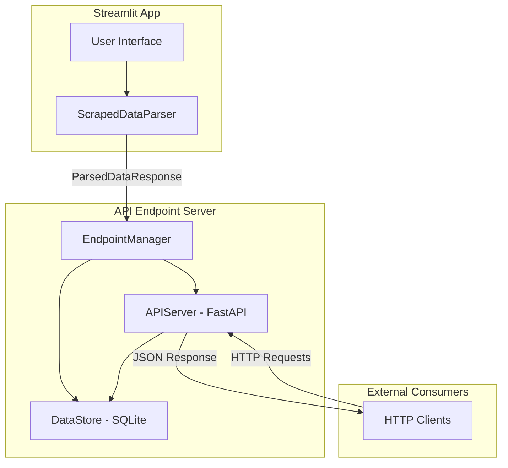
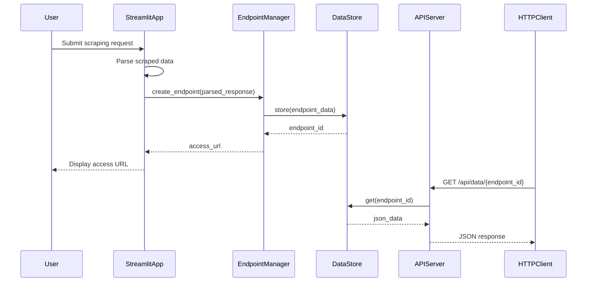

# Design Document: API Endpoint Server

## Overview

The API Endpoint Server provides a lightweight local HTTP server that exposes parsed JSON data from the Scraped Data Parser as RESTful API endpoints. Built using FastAPI for its simplicity and automatic OpenAPI documentation, the server stores endpoint configurations and data in SQLite for persistence. Users can create, retrieve, list, and delete endpoints through a simple REST interface.

## Architecture



### Component Interaction Flow



## Components and Interfaces

### 1. EndpointManager

The central orchestrator for creating and managing API endpoints.

```python
class EndpointManager:
    """Manages creation and lifecycle of API endpoints."""

    def __init__(self, data_store: DataStore):
        """Initialize with a data store instance."""
        pass

    def create_endpoint(
        self,
        parsed_response: ParsedDataResponse,
        description: str = None
    ) -> EndpointInfo:
        """
        Create a new API endpoint from parsed data.

        Args:
            parsed_response: The parsed data from ScrapedDataParser
            description: Optional description for the endpoint

        Returns:
            EndpointInfo with endpoint_id and access_url

        Raises:
            EndpointCreationError: If data is invalid or storage fails
        """
        pass

    def get_endpoint(self, endpoint_id: str) -> Optional[EndpointData]:
        """Retrieve endpoint data by ID."""
        pass

    def list_endpoints(self) -> List[EndpointInfo]:
        """List all available endpoints."""
        pass

    def delete_endpoint(self, endpoint_id: str) -> bool:
        """Delete an endpoint by ID. Returns True if deleted."""
        pass

    def get_access_url(self, endpoint_id: str, base_url: str) -> str:
        """Generate the full access URL for an endpoint."""
        pass
```

### 2. DataStore

SQLite-based persistence layer for endpoint data.

```python
class DataStore:
    """SQLite-based storage for endpoint data."""

    def __init__(self, db_path: str = "endpoints.db"):
        """Initialize database connection and create tables."""
        pass

    def store_endpoint(self, endpoint_data: EndpointData) -> str:
        """
        Store endpoint data and return the endpoint_id.

        Args:
            endpoint_data: The endpoint data to store

        Returns:
            The generated endpoint_id
        """
        pass

    def get_endpoint(self, endpoint_id: str) -> Optional[EndpointData]:
        """Retrieve endpoint data by ID."""
        pass

    def list_endpoints(self) -> List[EndpointInfo]:
        """List all stored endpoints (metadata only)."""
        pass

    def delete_endpoint(self, endpoint_id: str) -> bool:
        """Delete endpoint by ID. Returns True if deleted."""
        pass

    def close(self):
        """Close database connection."""
        pass
```

### 3. APIServer

FastAPI-based HTTP server for serving endpoints.

```python
class APIServer:
    """FastAPI server for serving API endpoints."""

    def __init__(
        self,
        data_store: DataStore,
        host: str = "127.0.0.1",
        port: int = 8080
    ):
        """Initialize the API server."""
        pass

    def start(self) -> str:
        """
        Start the server in a background thread.

        Returns:
            The base URL of the running server
        """
        pass

    def stop(self):
        """Stop the server gracefully."""
        pass

    def is_running(self) -> bool:
        """Check if server is currently running."""
        pass

    def get_base_url(self) -> str:
        """Get the base URL of the server."""
        pass
```

### 4. API Routes

```
GET  /api/data/{endpoint_id}           - Retrieve JSON data for endpoint
GET  /api/data/{endpoint_id}?metadata=true - Include parsing metadata
GET  /api/endpoints                     - List all endpoints
DELETE /api/endpoints/{endpoint_id}     - Delete an endpoint
GET  /health                            - Health check endpoint
```

## Data Models

### EndpointData

```python
@dataclass
class EndpointData:
    """Complete endpoint data including JSON payload."""

    endpoint_id: str
    json_data: Dict[str, Any]  # The actual parsed data
    metadata: EndpointMetadata
    created_at: datetime

    def to_dict(self) -> Dict[str, Any]:
        """Convert to dictionary for storage."""
        pass

    @classmethod
    def from_dict(cls, data: Dict[str, Any]) -> 'EndpointData':
        """Create from dictionary (deserialization)."""
        pass
```

### EndpointMetadata

```python
@dataclass
class EndpointMetadata:
    """Metadata about the endpoint."""

    description: str
    source_urls: List[str]
    records_count: int
    fields: List[str]
    parsing_timestamp: datetime

    def to_dict(self) -> Dict[str, Any]:
        """Convert to dictionary."""
        pass

    @classmethod
    def from_dict(cls, data: Dict[str, Any]) -> 'EndpointMetadata':
        """Create from dictionary."""
        pass
```

### EndpointInfo

```python
@dataclass
class EndpointInfo:
    """Summary information about an endpoint (for listing)."""

    endpoint_id: str
    access_url: str
    description: str
    created_at: datetime
    records_count: int

    def to_dict(self) -> Dict[str, Any]:
        """Convert to dictionary."""
        pass
```

### Database Schema

```sql
CREATE TABLE IF NOT EXISTS endpoints (
    endpoint_id TEXT PRIMARY KEY,
    json_data TEXT NOT NULL,           -- JSON string of the data
    description TEXT,
    source_urls TEXT,                  -- JSON array of URLs
    records_count INTEGER,
    fields TEXT,                       -- JSON array of field names
    parsing_timestamp TEXT,
    created_at TEXT NOT NULL
);

CREATE INDEX IF NOT EXISTS idx_created_at ON endpoints(created_at);
```

### Exception Classes

```python
class EndpointCreationError(Exception):
    """Raised when endpoint creation fails."""
    pass

class EndpointNotFoundError(Exception):
    """Raised when endpoint is not found."""
    pass

class ServerStartError(Exception):
    """Raised when server fails to start."""
    pass
```

## Correctness Properties

_A property is a characteristic or behavior that should hold true across all valid executions of a system—essentially, a formal statement about what the system should do. Properties serve as the bridge between human-readable specifications and machine-verifiable correctness guarantees._

### Property 1: Endpoint Creation Uniqueness

_For any_ valid ParsedDataResponse submitted to the EndpointManager, the created endpoint SHALL have a unique Endpoint_ID that does not match any previously created endpoint.

**Validates: Requirements 1.1**

### Property 2: Data Persistence Round-Trip

_For any_ ParsedDataResponse stored via the EndpointManager, retrieving the endpoint data via HTTP GET request SHALL return JSON data equivalent to the original parsed data.

**Validates: Requirements 1.2, 2.1, 6.4**

### Property 3: Access URL Validity

_For any_ successfully created endpoint, the returned Access_URL SHALL be a valid HTTP URL containing the endpoint_id and be accessible via GET request.

**Validates: Requirements 1.3**

### Property 4: Invalid Input Rejection

_For any_ empty or invalid ParsedDataResponse (null data, empty data dict), the EndpointManager SHALL raise an EndpointCreationError with a descriptive message.

**Validates: Requirements 1.4**

### Property 5: Non-Existent Endpoint Returns 404

_For any_ endpoint_id that does not exist in the DataStore, both GET and DELETE requests SHALL return HTTP status 404.

**Validates: Requirements 2.2, 4.3**

### Property 6: Response Content-Type Header

_For any_ successful API response from the server, the Content-Type header SHALL be "application/json".

**Validates: Requirements 2.3**

### Property 7: Metadata Query Parameter

_For any_ endpoint, a GET request with "?metadata=true" SHALL return a response containing both the data and the parsing metadata fields.

**Validates: Requirements 2.4**

### Property 8: List Consistency

_For any_ set of N created endpoints, the list endpoints API SHALL return exactly N items, each containing endpoint_id, access_url, created_at, and description fields.

**Validates: Requirements 3.1, 3.2**

### Property 9: Delete Removes Endpoint

_For any_ existing endpoint, after a successful DELETE request (HTTP 200), subsequent GET requests for that endpoint SHALL return HTTP 404.

**Validates: Requirements 4.1, 4.2**

### Property 10: Persistence Across Restarts

_For any_ endpoints created before server restart, those endpoints SHALL be accessible after the server restarts.

**Validates: Requirements 6.2, 6.3**

## Error Handling

### EndpointCreationError

Raised when:

- ParsedDataResponse contains empty or null data
- Database write operation fails
- Endpoint ID generation fails (collision after retries)

Response: Return descriptive error message to caller with details about the failure.

### EndpointNotFoundError

Raised when:

- GET request for non-existent endpoint_id
- DELETE request for non-existent endpoint_id

Response: HTTP 404 with JSON body `{"error": "Endpoint not found", "endpoint_id": "<id>"}`

### ServerStartError

Raised when:

- Configured port is in use and fallback fails
- Database initialization fails
- Server binding fails

Response: Log error and raise exception with port/binding details.

### Database Errors

Handled internally by DataStore:

- Connection failures: Retry with exponential backoff
- Write failures: Rollback transaction and raise EndpointCreationError
- Read failures: Return None or empty list as appropriate

### HTTP Error Responses

| Status Code | Condition          | Response Body                        |
| ----------- | ------------------ | ------------------------------------ |
| 200         | Success            | JSON data or confirmation            |
| 400         | Invalid request    | `{"error": "description"}`           |
| 404         | Endpoint not found | `{"error": "Endpoint not found"}`    |
| 500         | Server error       | `{"error": "Internal server error"}` |

## Testing Strategy

### Unit Tests

Unit tests verify specific examples and edge cases:

1. **EndpointManager Tests**

   - Create endpoint with valid ParsedDataResponse
   - Create endpoint with empty data (expect error)
   - Get existing endpoint
   - Get non-existent endpoint (returns None)
   - Delete existing endpoint
   - Delete non-existent endpoint (returns False)
   - List endpoints (empty and populated)

2. **DataStore Tests**

   - Store and retrieve endpoint data
   - List endpoints with various counts
   - Delete endpoint and verify removal
   - Database initialization creates tables
   - Handle concurrent access

3. **APIServer Tests**
   - Health check endpoint returns 200
   - GET endpoint returns correct data
   - GET with metadata=true includes metadata
   - DELETE endpoint returns 200
   - 404 for non-existent endpoints

### Property-Based Tests

Property-based tests verify universal properties across randomly generated inputs. Each test runs minimum 100 iterations.

**Testing Framework**: pytest with hypothesis

1. **Property 1 Test**: Generate random ParsedDataResponse objects, create endpoints, verify all IDs are unique

   - **Feature: api-endpoint-server, Property 1: Endpoint Creation Uniqueness**

2. **Property 2 Test**: Generate random JSON data, store via EndpointManager, retrieve via HTTP, compare equality

   - **Feature: api-endpoint-server, Property 2: Data Persistence Round-Trip**

3. **Property 4 Test**: Generate various invalid inputs (empty dicts, None values), verify EndpointCreationError raised

   - **Feature: api-endpoint-server, Property 4: Invalid Input Rejection**

4. **Property 5 Test**: Generate random non-existent endpoint IDs, verify 404 responses

   - **Feature: api-endpoint-server, Property 5: Non-Existent Endpoint Returns 404**

5. **Property 8 Test**: Create N random endpoints, verify list returns exactly N items with required fields

   - **Feature: api-endpoint-server, Property 8: List Consistency**

6. **Property 9 Test**: Create random endpoints, delete them, verify subsequent GET returns 404
   - **Feature: api-endpoint-server, Property 9: Delete Removes Endpoint**

### Test Configuration

```python
# pytest.ini or pyproject.toml
[tool.pytest.ini_options]
testpaths = ["api_server/test"]
python_files = ["test_*.py"]

# Hypothesis settings for property tests
hypothesis_settings = {
    "max_examples": 100,
    "deadline": None
}
```

### Test File Structure

```
api_server/
├── test/
│   ├── __init__.py
│   ├── test_endpoint_manager.py      # Unit tests for EndpointManager
│   ├── test_data_store.py            # Unit tests for DataStore
│   ├── test_api_server.py            # Unit tests for API routes
│   ├── test_properties.py            # Property-based tests
│   └── conftest.py                   # Shared fixtures
```
