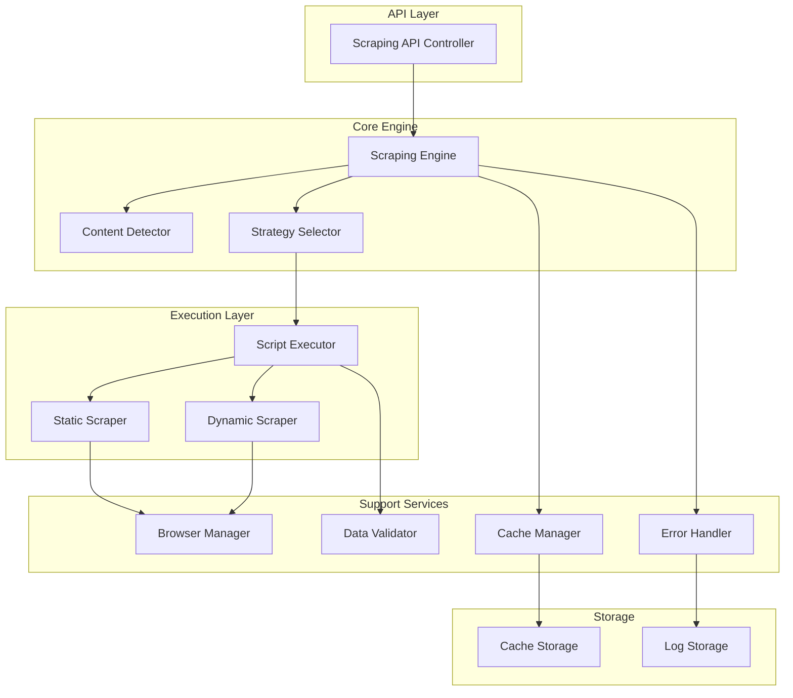

# Design Document

## Overview

The Universal Scraping Layer is designed as a modular, high-performance system that can handle any website type through intelligent strategy selection and robust execution. The architecture emphasizes safety, performance, and extensibility while providing a clean interface for AI-generated script execution.

The system uses a hybrid approach: lightweight HTTP requests for static content and full browser automation for dynamic content. A smart detection system automatically chooses the optimal strategy, while a comprehensive error handling system ensures reliability even with challenging websites.

## Architecture

The Universal Scraping Layer follows a layered architecture with clear separation of concerns:



## Components and Interfaces

### Scraping Engine

The central orchestrator that coordinates all scraping operations.

**Interface:**

```python
class ScrapingEngine:
    async def scrape(self, script_config: ScriptConfig) -> ScrapingResult
    async def validate_script(self, script: str) -> ValidationResult
    def get_supported_strategies(self) -> List[str]
```

**Responsibilities:**

- Coordinate scraping workflow
- Manage strategy selection
- Handle high-level error recovery
- Provide unified interface to external systems

### Content Detector

Analyzes websites to determine optimal scraping strategy.

**Interface:**

```python
class ContentDetector:
    async def analyze_website(self, url: str) -> WebsiteAnalysis
    def detect_framework(self, html: str) -> FrameworkInfo
    def requires_javascript(self, url: str) -> bool
```

**Detection Logic:**

- **Static Detection**: Checks for complete content in initial HTML response
- **Framework Detection**: Identifies React, Angular, Vue.js through DOM patterns and script tags
- **Dynamic Content**: Detects AJAX endpoints and lazy-loading patterns
- **Anti-bot Measures**: Identifies Cloudflare, reCAPTCHA, and other protection systems

### Script Executor

Safely executes AI-generated scraping scripts in isolated environments.

**Interface:**

```python
class ScriptExecutor:
    async def execute_script(self, script: str, context: ExecutionContext) -> ExecutionResult
    def validate_script_safety(self, script: str) -> SecurityValidation
    def create_sandbox(self) -> SandboxEnvironment
```

**Security Features:**

- **Process Isolation**: Each script runs in separate process
- **Resource Limits**: CPU, memory, and time constraints
- **Network Restrictions**: Limited to specified domains
- **File System Isolation**: Restricted access to designated directories

### Static Scraper

Optimized for traditional HTML websites using HTTP requests.

**Interface:**

```python
class StaticScraper:
    async def scrape_static(self, config: StaticScrapingConfig) -> List[Dict]
    def extract_with_selectors(self, html: str, selectors: Dict) -> Dict
    def handle_pagination(self, base_url: str, pagination_config: Dict) -> List[str]
```

**Features:**

- **BeautifulSoup Integration**: CSS and XPath selector support
- **Session Management**: Cookie and header persistence
- **Pagination Handling**: Automatic page traversal
- **Form Submission**: POST request support for search forms

### Dynamic Scraper

Handles JavaScript-heavy websites using browser automation.

**Interface:**

```python
class DynamicScraper:
    async def scrape_dynamic(self, config: DynamicScrapingConfig) -> List[Dict]
    async def wait_for_content(self, page: Page, selector: str, timeout: int) -> bool
    async def simulate_interactions(self, page: Page, interactions: List[Interaction]) -> None
```

**Capabilities:**

- **Playwright Integration**: Full browser automation
- **Smart Waiting**: Content-aware loading detection
- **User Interaction**: Click, scroll, form filling simulation
- **JavaScript Execution**: Custom script injection for data extraction

### Browser Manager

Manages headless browser instances for optimal resource utilization.

**Interface:**

```python
class BrowserManager:
    async def get_browser(self, requirements: BrowserRequirements) -> Browser
    async def release_browser(self, browser: Browser) -> None
    def cleanup_idle_browsers(self) -> None
```

**Resource Management:**

- **Instance Pooling**: Reuse browsers across requests
- **Memory Monitoring**: Automatic restart on memory leaks
- **Concurrent Limits**: Maximum browser instance controls
- **Cleanup Scheduling**: Periodic resource cleanup

## Data Models

### ScriptConfig

Configuration for AI-generated scraping scripts:

```python
@dataclass
class ScriptConfig:
    url: str
    script_type: Literal["static", "dynamic", "hybrid"]
    selectors: Dict[str, str]
    pagination: Optional[PaginationConfig]
    interactions: List[InteractionStep]
    output_schema: Dict[str, Any]
    retry_config: RetryConfig
    cache_ttl: int
```

### ScrapingResult

Standardized result format for all scraping operations:

```python
@dataclass
class ScrapingResult:
    success: bool
    data: List[Dict[str, Any]]
    metadata: ScrapingMetadata
    errors: List[ScrapingError]
    performance_metrics: PerformanceMetrics
    cache_info: CacheInfo
```

### WebsiteAnalysis

Analysis results from content detection:

```python
@dataclass
class WebsiteAnalysis:
    is_static: bool
    framework: Optional[str]
    requires_javascript: bool
    has_anti_bot: bool
    estimated_load_time: float
    recommended_strategy: str
    confidence_score: float
```

## Error Handling

### Error Classification

**Network Errors:**

- Connection timeouts
- DNS resolution failures
- HTTP error codes (4xx, 5xx)

**Content Errors:**

- Missing selectors
- Malformed HTML/JSON
- Empty result sets

**Security Errors:**

- Anti-bot detection
- Rate limiting
- CAPTCHA challenges

**System Errors:**

- Resource exhaustion
- Browser crashes
- Script execution failures

### Recovery Strategies

**Exponential Backoff:**

```python
async def retry_with_backoff(operation, max_retries=3):
    for attempt in range(max_retries):
        try:
            return await operation()
        except RetryableError as e:
            if attempt == max_retries - 1:
                raise
            await asyncio.sleep(2 ** attempt)
```

**Fallback Strategies:**

- Dynamic → Static fallback for simple content
- User agent rotation for anti-bot measures
- Proxy rotation for IP-based blocking
- Alternative selector strategies

## Testing Strategy

### Unit Testing

**Component Testing:**

- Individual component functionality
- Mock external dependencies
- Edge case validation
- Error condition handling

**Integration Testing:**

- Component interaction validation
- End-to-end workflow testing
- Performance benchmarking
- Resource cleanup verification

### Property-Based Testing

Property-based testing validates universal behaviors across diverse inputs using automated test case generation.

## Correctness Properties

_A property is a characteristic or behavior that should hold true across all valid executions of a system—essentially, a formal statement about what the system should do. Properties serve as the bridge between human-readable specifications and machine-verifiable correctness guarantees._

### Property 1: Strategy Selection Consistency

_For any_ website URL, the Scraping_Engine should consistently select the same scraping strategy (static vs dynamic) when analyzing identical content
**Validates: Requirements 1.1, 1.2**

### Property 2: Framework Detection Accuracy

_For any_ website containing JavaScript framework signatures, the Content_Detector should correctly identify the specific framework type with consistent results
**Validates: Requirements 3.2**

### Property 3: Script Validation Completeness

_For any_ AI-generated scraping script, the Script_Executor should validate all required structural elements before execution and reject invalid scripts with descriptive errors
**Validates: Requirements 2.1, 2.3**

### Property 4: Execution Sandboxing

_For any_ script execution, the Script_Executor should enforce security boundaries preventing unauthorized file system and network access
**Validates: Requirements 2.2, 10.1, 10.2, 10.3**

### Property 5: Retry Behavior Consistency

_For any_ retryable failure, the Error_Handler should implement exponential backoff with consistent timing intervals and maximum retry limits
**Validates: Requirements 2.4, 5.1**

### Property 6: Data Structure Preservation

_For any_ successful scraping operation, the returned data should conform to the specified output schema with all required fields present or marked as missing
**Validates: Requirements 2.5, 4.1, 4.4**

### Property 7: Content Loading Patience

_For any_ JavaScript-rendered website, the Dynamic_Scraper should wait for content to fully load before attempting data extraction
**Validates: Requirements 1.3, 1.4**

### Property 8: Data Cleaning Consistency

_For any_ extracted data containing HTML entities or malformed content, the Data_Extractor should consistently clean and normalize the data to the same output format
**Validates: Requirements 4.2, 4.3**

### Property 9: Cache Freshness Management

_For any_ cached data, the Cache_Manager should return cached results when fresh and trigger re-scraping when expired based on configured TTL
**Validates: Requirements 7.2, 7.3**

### Property 10: Resource Cleanup Completeness

_For any_ browser instance used in scraping, the Browser_Manager should properly release all associated resources upon completion
**Validates: Requirements 6.4**

### Property 11: Browser Instance Reuse

_For any_ concurrent scraping requests with compatible requirements, the Browser_Manager should reuse existing browser instances when possible
**Validates: Requirements 6.1**

### Property 12: Static Strategy Optimization

_For any_ website identified as static, the Static_Scraper should use HTTP requests instead of browser automation for data extraction
**Validates: Requirements 6.3**

### Property 13: Error Logging Completeness

_For any_ error condition during scraping, the Error_Handler should log detailed error information with sufficient context for debugging
**Validates: Requirements 9.2**

### Property 14: Template Execution Support

_For any_ valid BeautifulSoup or Playwright template, the Script_Executor should successfully execute the template and return structured results
**Validates: Requirements 8.1, 8.2**

### Property 15: Security Validation Strictness

_For any_ script containing potentially dangerous operations, the Script_Executor should reject execution and provide detailed security warnings
**Validates: Requirements 10.5**

### Property 16: Cache Storage Consistency

_For any_ successfully scraped data, the Cache_Manager should store the data with accurate timestamp metadata and retrieve it consistently
**Validates: Requirements 7.1**

### Property 17: Fallback Strategy Reliability

_For any_ JavaScript execution failure, the Error_Handler should attempt static scraping fallback when the content structure permits
**Validates: Requirements 5.4**

### Property 18: Resource Limit Enforcement

_For any_ script execution exceeding resource limits, the Script_Executor should terminate execution within the configured timeout period
**Validates: Requirements 10.4**

### Property 19: Anti-bot Countermeasure Effectiveness

_For any_ anti-bot detection event, the Error_Handler should implement appropriate countermeasures including delays and user agent rotation
**Validates: Requirements 5.3**

### Property 20: Queue Management Fairness

_For any_ situation where concurrent requests exceed capacity, the Scraping_Engine should queue requests and process them according to priority rules
**Validates: Requirements 6.5**

## Testing Strategy

### Dual Testing Approach

The Universal Scraping Layer requires both unit testing and property-based testing to ensure comprehensive coverage:

**Unit Tests:**

- Test specific scraping scenarios with known websites
- Validate error handling with controlled failure conditions
- Test browser lifecycle management with mock browsers
- Verify cache operations with known data sets
- Test security boundaries with specific malicious scripts

**Property-Based Tests:**

- Validate universal behaviors across diverse website types
- Test strategy selection consistency across random URL inputs
- Verify data cleaning across various malformed content types
- Test retry behavior with random failure patterns
- Validate resource management across concurrent load scenarios

### Property-Based Testing Configuration

**Framework:** Hypothesis (Python) for property-based test generation
**Test Configuration:**

- Minimum 100 iterations per property test
- Custom generators for website content, scraping scripts, and error conditions
- Each property test tagged with: **Feature: universal-scraping-layer, Property {number}: {property_text}**

**Test Generators:**

- **Website Generator:** Creates diverse HTML content with various framework signatures
- **Script Generator:** Generates valid and invalid scraping scripts with different complexity levels
- **Error Generator:** Simulates network failures, timeouts, and anti-bot responses
- **Content Generator:** Creates malformed HTML, missing fields, and edge case data structures

### Integration Testing

**End-to-End Scenarios:**

- Complete scraping workflows from script input to data output
- Multi-strategy fallback chains (dynamic → static)
- Concurrent request handling under load
- Cache lifecycle management across multiple scraping cycles
- Browser resource management during extended operations

**Performance Testing:**

- Memory usage monitoring during extended browser sessions
- Response time validation across different website types
- Concurrent request throughput measurement
- Cache hit ratio optimization validation
- Resource cleanup verification under stress conditions
