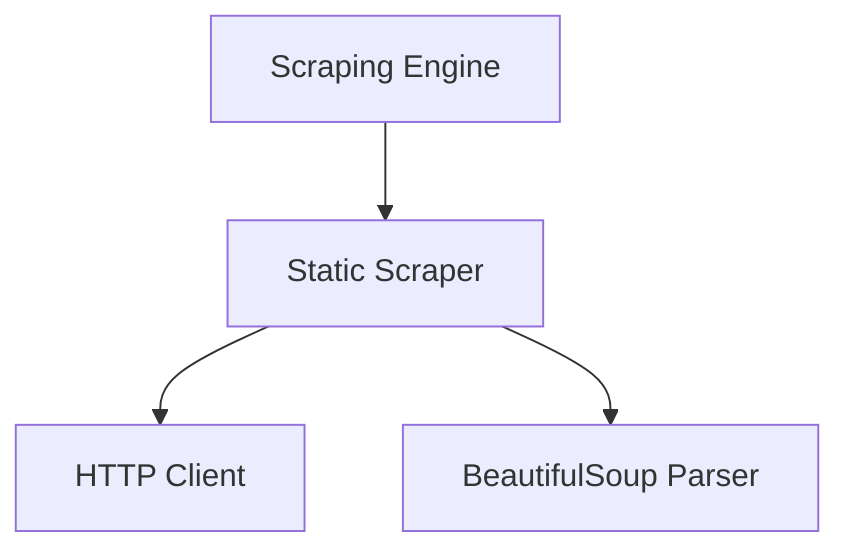

# Design Document

## Overview

The Universal Scraping Layer (Phase 1) is a simple, focused system for extracting data from static HTML websites. It uses HTTP requests and BeautifulSoup for CSS selector-based extraction, providing a clean interface for the AI-Powered API Generator.

This phase focuses on getting a working scraper with minimal complexity. Future phases will add dynamic scraping, caching, and advanced error handling.

## Architecture

The system follows a simple two-layer architecture:



**Components:**

- **Scraping Engine**: Orchestrates scraping operations and returns structured results
- **Static Scraper**: Fetches HTML and extracts data using CSS selectors

## Components and Interfaces

### Scraping Engine

The central orchestrator that coordinates scraping operations.

**Interface:**

```python
class ScrapingEngine:
    async def scrape(self, script_config: ScriptConfig) -> ScrapingResult
```

**Responsibilities:**

- Accept scraping configuration (URL + selectors)
- Delegate to Static Scraper
- Return structured results

### Static Scraper

Extracts data from static HTML websites using HTTP requests.

**Interface:**

```python
class StaticScraper:
    async def scrape_static(self, config: StaticScrapingConfig) -> List[Dict[str, Any]]
```

**Features:**

- **HTTP Requests**: Uses `requests` library for fetching HTML
- **BeautifulSoup Integration**: CSS selector support for data extraction
- **Simple and Fast**: No browser overhead, pure HTML parsing

## Data Models

### ScriptConfig

Configuration for scraping operations:

```python
@dataclass
class ScriptConfig:
    url: str
    selectors: Dict[str, str]  # field_name -> CSS selector
    timeout: int = 30
```

### ScrapingResult

Standardized result format:

```python
@dataclass
class ScrapingResult:
    success: bool
    data: List[Dict[str, Any]]
    metadata: ScrapingMetadata
    errors: List[ScrapingError]
```

### StaticScrapingConfig

Configuration specific to static scraping:

```python
@dataclass
class StaticScrapingConfig:
    url: str
    selectors: Dict[str, str]
    timeout: int = 30
```

## Testing Strategy

### Unit Testing

**Component Testing:**

- Test HTTP request handling with mock responses
- Test CSS selector extraction with sample HTML
- Test error cases (network failures, invalid selectors)
- Test empty result handling

**Example Tests:**

- Valid URL with valid selectors returns data
- Invalid URL returns error
- Empty selectors return empty results
- Network timeout is handled gracefully

### Integration Testing

**End-to-End Scenarios:**

- Complete scraping workflow from URL to structured data
- Multiple selectors extraction
- Real website scraping (with test sites)

## Correctness Properties

_A property is a characteristic or behavior that should hold true across all valid executions of a system._

### Property 1: Successful Scraping Returns Data

_For any_ valid URL and valid CSS selectors, the Static_Scraper should return a list of dictionaries containing the extracted data
**Validates: Requirements 1.1, 1.2, 1.3**

### Property 2: Invalid Selectors Return Empty Results

_For any_ valid URL with selectors that don't match any elements, the Static_Scraper should return empty values for those fields
**Validates: Requirements 1.5**

### Property 3: Result Structure Consistency

_For any_ successful scraping operation, the ScrapingResult should have success=True and data as a list
**Validates: Requirements 2.1, 2.5**

## Implementation Notes

**Phase 1 Scope:**

- Static HTML scraping only
- No caching
- No error retry logic
- No data cleaning
- No browser automation

**Future Phases:**

- Phase 2: Add basic error handling and retry logic
- Phase 3: Add data cleaning and validation
- Phase 4: Add dynamic scraping with Playwright
- Phase 5: Add caching layer
